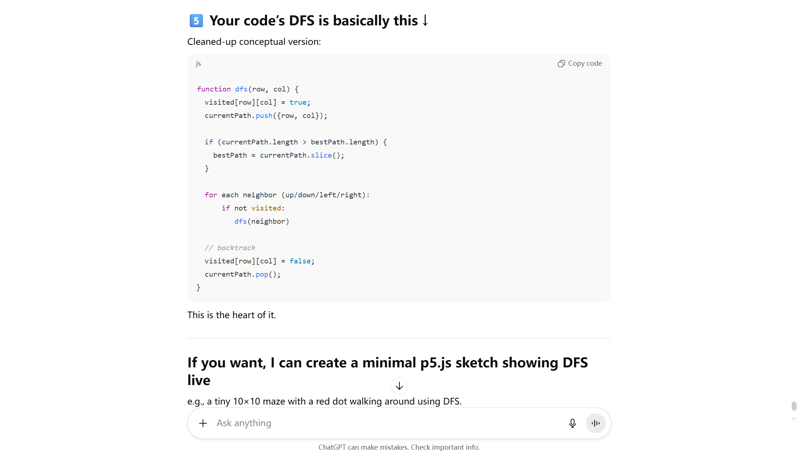

# Audio: Mondrian City Subway

Bocheng Meng (bmen0195) – IDEA9103 Major Project Individual Submission

## 1. Instructions

- **Load the Project**: Open in a web browser (Chrome recommended for best audio support). Ensure your sound is on.
- **Start the Animation**: Click anywhere on the canvas to begin the experience. No further interaction is required. (If you want to replay the animation, refresh or click again after it finishes to restart the journey.)

## 2. Details of the Individual Approach

### Overview:
For my individual project, the core idea was to simulate a subway train navigating through a Mondrian-style city grid. I used an audio track of a subway train as the driving force. When the subway sound plays, a sequence of colored blocks (from the group project) lights up along black grid lines, giving the impression of a subway traveling through the city.

### Differentiation:
I chose audio as the primary driver for my code, distinguishing my work from teammates who might use interaction, time, or randomness. My implementation is unique in that it reveals the composition gradually in sync with an audio narrative. Instead of showing all parts of the image at once or changing colors interactively, my sketch uncovers a path through the grid step by step, guided by sound.

### Inspiration:
The key inspiration was the iconic New York City Subway map designed by Massimo Vignelli (1972). That diagrammatic map simplified the chaotic city into clean lines and bold colors, just like the concept of Mondrian painting. It famously organized subway routes into a grid-like arrangement.

The 1972 New York City Subway diagram designed by Massimo Vignelli.

## 3. Technical Implementation

To achieve the audio-synchronized animation, I made significant additions and modifications to our group's p5.js code.

- **Path Finding with Depth-First Search (DFS)**: The first challenge was to have a single continuous path for the "train" to follow. To do this, I wrote a class called RoadGrid that computes a path through the road network. I used depth-first search algorithm with backtracking to find a lengthy route. (I wasn't initially sure how to implement this, so I consulted GPT 5.1 for ideas. It suggested a DFS-based approach to maximize the path length, which I then adapted into my code. I have credited this in my code comments.)
  
  
  
  
  https://chatgpt.com/s/t_691ae4dcbbac81918c31ce019237466a  
  https://chatgpt.com/s/t_691ae4ffa11c8191ae3fa38cf06459d7

- **Layered Drawing (V2 Black Tracks and V1 Colored Train)**: In the group's original code, all road blocks were drawn in color at once. I restructured the drawing into two layers for clarity and control. Layer V2 is the base: it draws the grid of black squares (these represent the tracks or roads). It looks like a network of black lines forming an old black Mondrian-style grid. On top of that, Layer V1 holds the colored squares, which will form the animated train path.

- **Audio Integration with p5.Sound**: The centerpiece of this project is the integration of an audio file to control the visuals. I used the p5.js sound library to load and analyze the audio. During each frame of the draw() loop, I query the current loudness of the audio via audioAnalyzer.getLevel(). This gives a value representing how loud the sound is at that moment. I use that value to adjust the animation speed: essentially, I map the loudness to a certain incremental step for the train's progress along the path. If the sound is below a threshold (very quiet), I interpret that as the train being stopped. If the sound is louder, the train moves faster. This way, the train stops at silence and accelerates with sound, mirroring the real behavior of a train at stations vs. moving between stations.

- **Audio-Reactive Visual Effects**: Apart from controlling the train's motion, I added another audio-responsive element: the large colored blocks in the composition pulse with the sound.

- **Other Code Modifications**: In making these changes, I also refactored and simplified parts of the original group code. For instance, I removed the mouse-tracking shadow effect on the picture frame (to improve render speed).